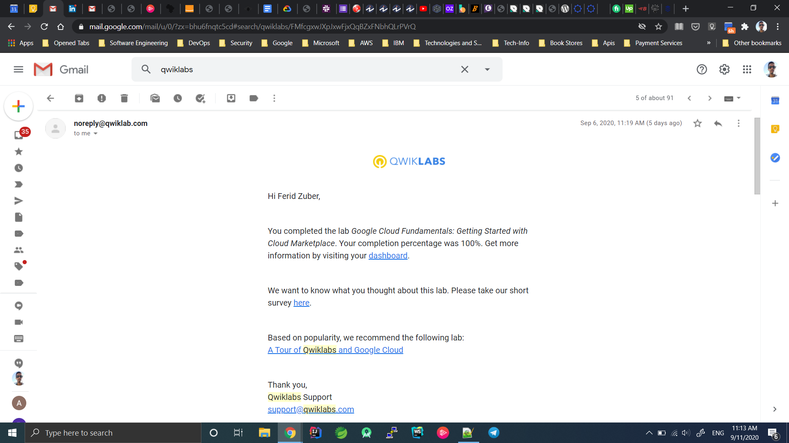
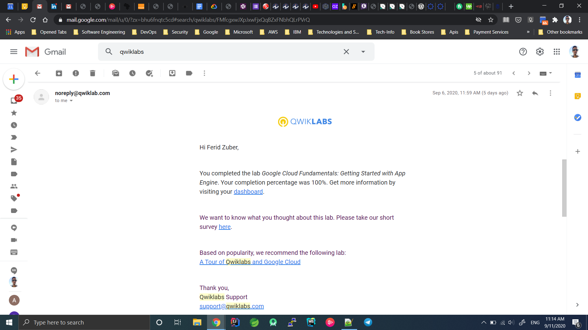
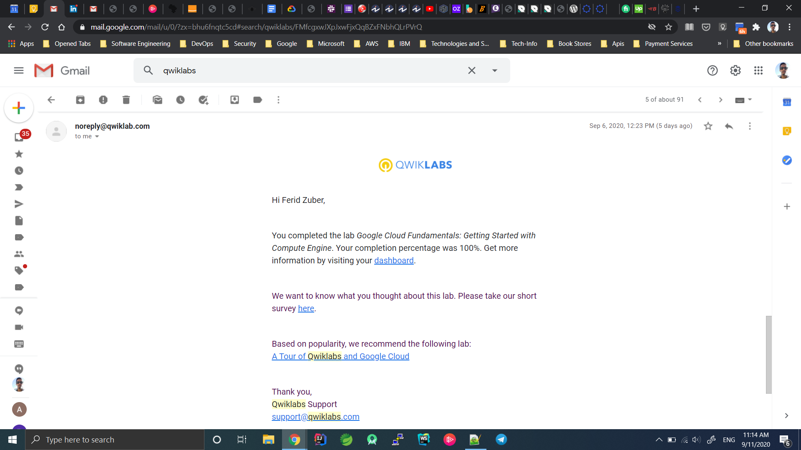
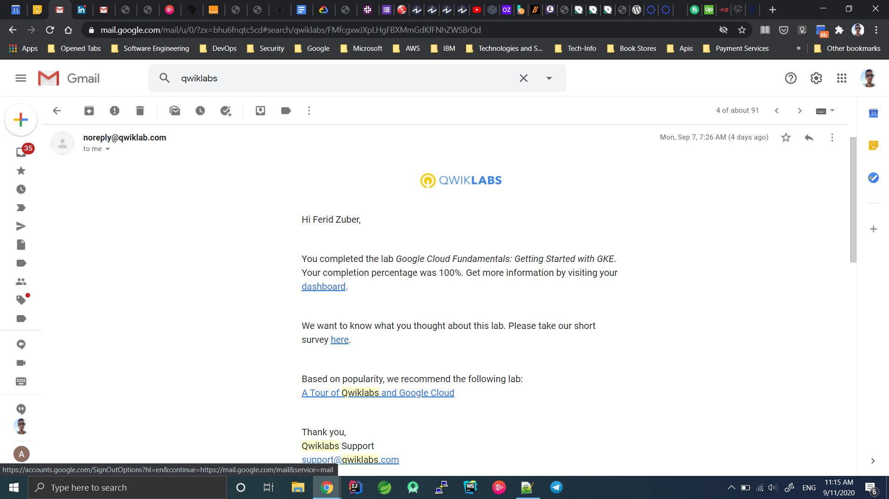
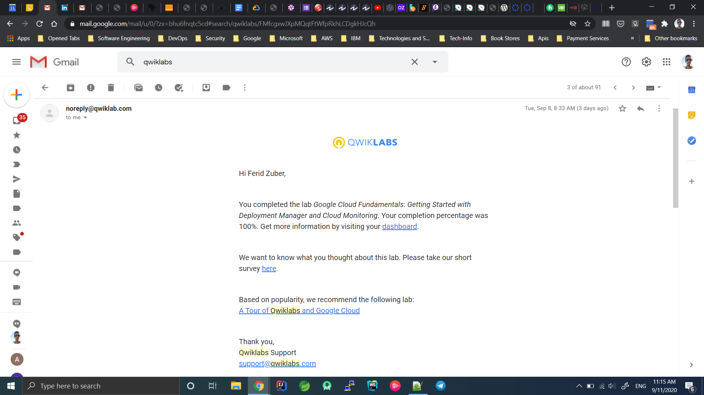
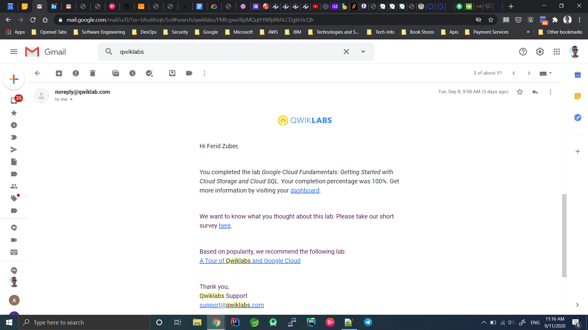
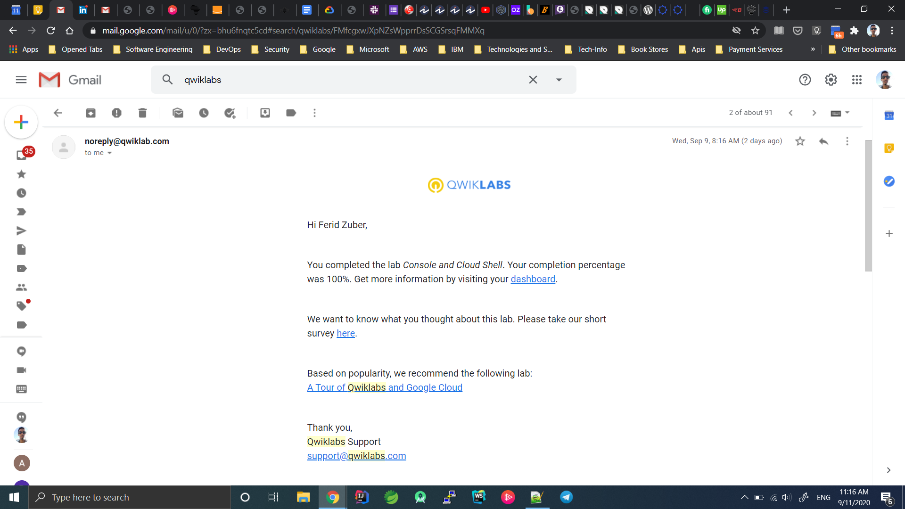
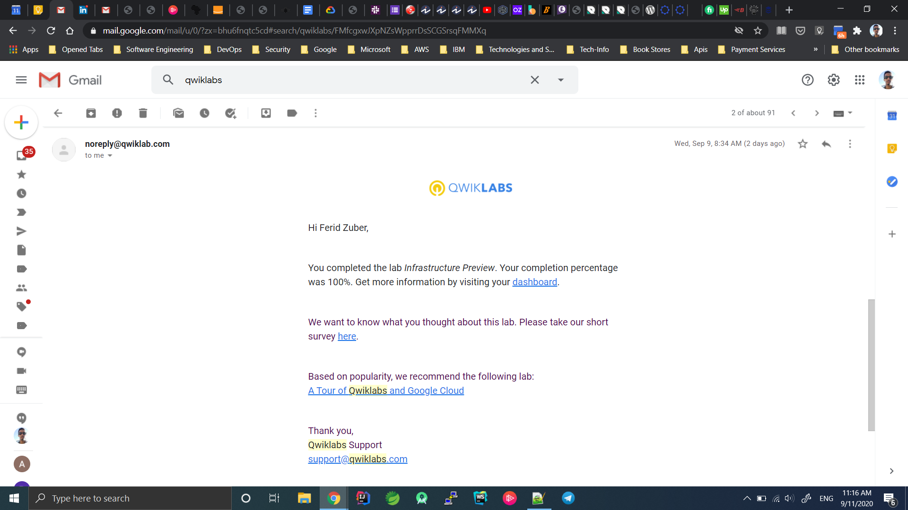
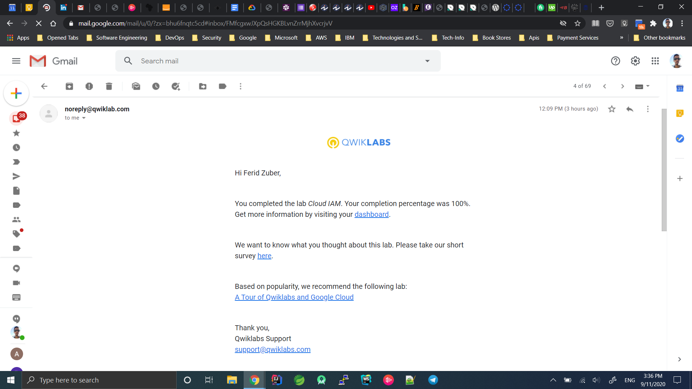

# Completed Lab Screenshots

## Google Cloud Fundamentals: Getting Started with Cloud Marketplace

## Google Cloud Fundamentals: Getting Started with App Engine

## Google Cloud Fundamentals: Getting Started with Compute Engine

## Google Cloud Fundamentals: Getting Started with GKE

## Google Cloud Fundamentals: Getting Started with BigQuery

## Google Cloud Fundamentals: Getting Started with Deployment Manager and Cloud Monitoring

## [Google Cloud Fundamentals: Getting Started with Cloud Storage and Cloud SQL

## Console and Cloud Shell

## Infrastructure Preview

## Cloud IAM
